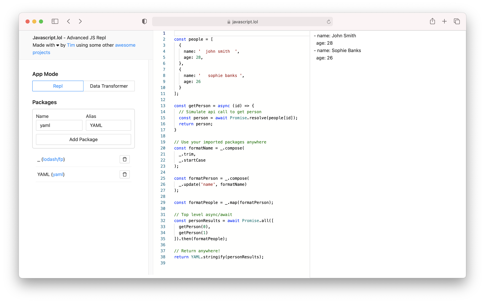
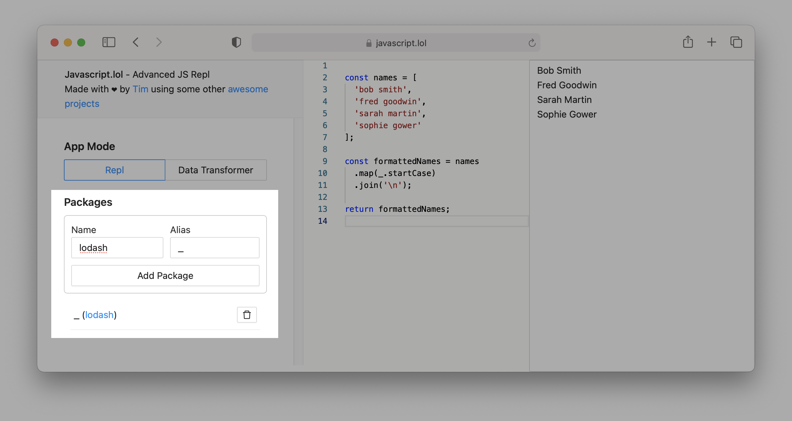
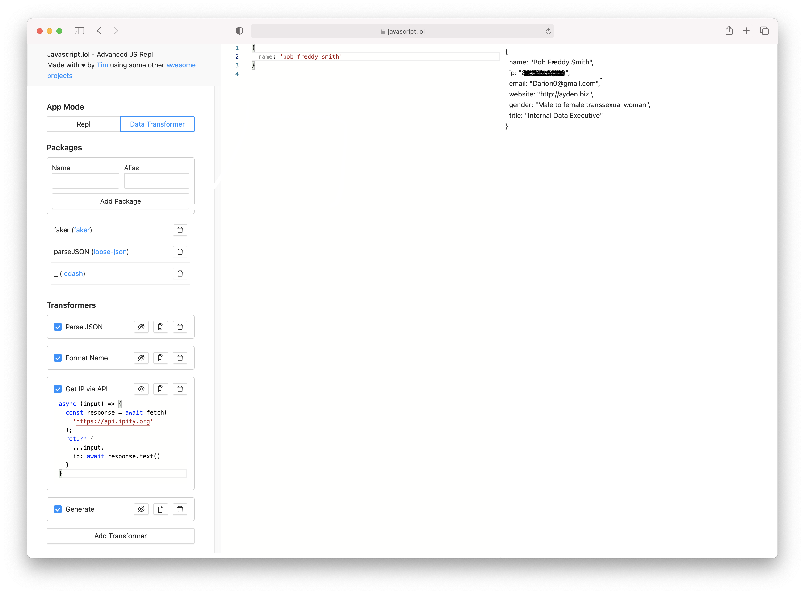

# [javascript.lol](https://javascript.lol) - the javascript repl with superpowers!
An in-browser javascript repl with flow based prototyping, dynamic module imports and much more!

Get started with some of the [examples below](#examples) or visit the app directly at [javascript.lol](https://javascript.lol)

## Features
The app is currently in alpha so expect the odd issue here and there and feel free to raise an issue. I'm planning to open source the code at some point depending on whether people decide to use the app so stay tuned!

- [x] Dynamic npm module/package imports using [skypack](https://www.skypack.dev/). Any imported package (that isn't reliant on Node.JS API's) will be preoptimized by skypack for browser use!
- [x] Top level async await
- [x] [Repl mode](#repl) - Prototype code and see the results instantly without having to download packages on your local machine
- [x] [Transformer mode](#transformers) - Define a list of individual code snippets to be exectued sequentially on the input
- [x] Portable and client sided - Every change you make will be saved in the url so you can bookmark transformers or snippets and revisit them with ease or share them with friends/colleagues
- [ ] Highly configurable via options
- [ ] Intellisense support
- [ ] Dark mode
- [ ] View only mode so you can distribute your data transformers for less technical users to use (for data normalisation, etc)
- [ ] Multiple transformers/repl's in a single instance
- [ ] Community transformer bundles - Maybe have community shared transformer bundles and popular ones can be imported? This is open to discussion

## Examples
The best way to learn how to use the app is to dig straight into some examples. Please feel free to raise an MR if you feel some better examples could be featured here!

- Repl [Multiple Package Imports with top level async/await](https://javascript.lol/?input=%0Aconst+people+%3D+%5B%0A++%7B%0A++++name%3A+%27++john+smith++%27%2C%0A++++age%3A+28%2C%0A++%7D%2C%0A++%7B%0A++++name%3A+%27+++sophie+banks+%27%2C%0A++++age%3A+26%0A++%7D%0A%5D%3B%0A%0Aconst+getPerson+%3D+async+%28id%29+%3D%3E+%7B%0A++%2F%2F+Simulate+api+call+to+get+person%0A++const+person+%3D+await+Promise.resolve%28people%5Bid%5D%29%3B%0A++return+person%3B%0A%7D%0A%0A%2F%2F+Use+your+imported+packages+anywhere%0Aconst+formatName+%3D+_.compose%28%0A++_.trim%2C%0A++_.startCase%0A%29%3B%0A%0Aconst+formatPerson+%3D+_.compose%28%0A++_.update%28%27name%27%2C+formatName%29%0A%29%3B%0A%0Aconst+formatPeople+%3D+_.map%28formatPerson%29%3B%0A%0A%2F%2F+Top+level+async%2Fawait%0Aconst+personResults+%3D+await+Promise.all%28%5B%0A++getPerson%280%29%2C%0A++getPerson%281%29%0A%5D%29.then%28formatPeople%29%3B%0A%0A%2F%2F+Return+anywhere%21%0Areturn+YAML.stringify%28personResults%29%3B%0A&appMode=repl&packages=lodash%2Ffp%2C_%7Cyaml%2CYAML&transformers=%5B%5D)
- Transformer [Simple loosly defined JSON to YAML converter](https://javascript.lol/?input=%7B%0A++name%3A+%22Sophie%22%2C%0A++gender%3A+%27female%27%2C%0A++friends%3A+%5B%27Sarah%27%2C+%27Paul%27%2C+%27John%27%5D%0A%7D&appMode=transformer&packages=loose-json%2CparseJSON%7Cyaml%2CYAML&transformers=%5B%7B%22mode%22%3A%22edit%22%2C%22enabled%22%3Atrue%2C%22input%22%3A%22parseJSON%22%2C%22name%22%3A%22Parse+JSON%22%2C%22id%22%3A%22kq3DETJhfYKlfxq-dFYHV%22%7D%2C%7B%22input%22%3A%22YAML.stringify%22%2C%22name%22%3A%22to+YAML%22%2C%22enabled%22%3Atrue%2C%22mode%22%3A%22edit%22%2C%22id%22%3A%22CNJDBgx9g6U4YcHYCQNNH%22%7D%5D)
- Transformer [Demonstrating all possible code signatures for a tranformer code block](https://javascript.lol/?input=+++++++Hello+world%21&appMode=transformer&packages=lodash%2Ffp%2C_%7Cdelay%2Cdelay&transformers=%5B%7B%22input%22%3A%22Promise.resolve%28input%29%22%2C%22name%22%3A%22Identity+%28promise%29%22%2C%22enabled%22%3Atrue%2C%22mode%22%3A%22edit%22%2C%22id%22%3A%22HSWoW1PumkHokQh2Gw_pV%22%7D%2C%7B%22input%22%3A%22_.toUpper%22%2C%22name%22%3A%22Capitalise+%28fn%29%22%2C%22enabled%22%3Atrue%2C%22mode%22%3A%22edit%22%2C%22id%22%3A%22kIs3EeibcFiapcipbzo_u%22%7D%2C%7B%22input%22%3A%22%28input%29+%3D%3E+input.concat%28%5Cn++%27+how+are+you%3F%27%5Cn%29%22%2C%22name%22%3A%22Question+%28fn%29%22%2C%22enabled%22%3Atrue%2C%22mode%22%3A%22edit%22%2C%22id%22%3A%22QGdNNOyNte9PHFhzmbius%22%7D%2C%7B%22enabled%22%3Atrue%2C%22input%22%3A%22async+%28input%29+%3D%3E+%7B%5Cn++const+timeStart+%3D+performance.now%28%29%3B%5Cn++%2F%2F+wait+between+100-300+ms%5Cn++await+delay%28_.random%28100%2C+300%29%29%3B%5Cn++const+duration+%3D+performance.now%28%29+-+timeStart%3B%5Cn++return+%60%24%7B%5Cn++++input%5Cn++%7D+time+was+%24%7B%5Cn++++duration.toFixed%280%29%5Cn++%7Dms%21%60%3B%5Cn%7D%22%2C%22name%22%3A%22Delayed+%28promise%29%22%2C%22mode%22%3A%22edit%22%2C%22id%22%3A%22SOEA0R3CUh5Cym1MGKEZq%22%7D%2C%7B%22enabled%22%3Atrue%2C%22input%22%3A%22input.trim%28%29%22%2C%22name%22%3A%22Trim+%28statement%29%22%2C%22mode%22%3A%22edit%22%2C%22id%22%3A%226yOU5foa-o-ymGBALM8yG%22%7D%5D)
- Transformer [Parse JSON -> Pick Attributes -> Query String](https://javascript.lol/?input=%7B%0A++name%3A+%22John%22%2C%0A++%22website%22%3A+%22http%3A%2F%2Fexample.com%22%2C%0A++gender%3A+%27Male%27%2C%0A++address%3A+%2750+Fake+Road%27%0A%7D&appMode=transformer&packages=loose-json%2CparseJSON%7Cqs%2Cqs%7Clodash%2C_&transformers=%5B%7B%22input%22%3A%22parseJSON%22%2C%22name%22%3A%22Parse+JSON%22%2C%22enabled%22%3Atrue%2C%22mode%22%3A%22edit%22%2C%22id%22%3A%22F1kYnA4JPu8-uMpS-ZmmP%22%7D%2C%7B%22input%22%3A%22_.partialRight%28%5Cn++_.pick%2C%5Cn++%5B%27name%27%2C+%27website%27%5D%5Cn%29%22%2C%22name%22%3A%22Pick+Attributes%22%2C%22enabled%22%3Atrue%2C%22mode%22%3A%22edit%22%2C%22id%22%3A%22V0qjVLJzSGXU8IUGnOgUQ%22%7D%2C%7B%22enabled%22%3Atrue%2C%22input%22%3A%22qs.stringify%22%2C%22name%22%3A%22to+Query+String%22%2C%22mode%22%3A%22edit%22%2C%22id%22%3A%22txyfealvNI7e91kMsivr9%22%7D%5D)

## Usage

Please refer to the usage guide below and [raise any issues in this github repository](https://github.com/tim-crisp/javascript.lol/issues).

### Packages

Packages are imported through the packages section of the app and are accessible via the repl or transformer code blocks through their alias (which will default to the package name if not provided).

### App Mode

The app has two states, repl mode and transformer mode.

#### Repl
Repl mode is what it says on the tin, an in-browser javascript repl with superpowers!

#### Transformers

Transformers are a set of nodes that are executed sequentially. Each transformer receives the result of the previous transformer and applies its code block to the input. It's the equivalent of [pipeing in functional libraries like ramda](https://ramdajs.com/0.22.1/docs/#pipe).

You can drag transformers to change their order. They are executed in order from top to bottom.

## Credits
Please refer to the credits on the [javascript.lol](https://javascript.lol) app! (work in progress).
